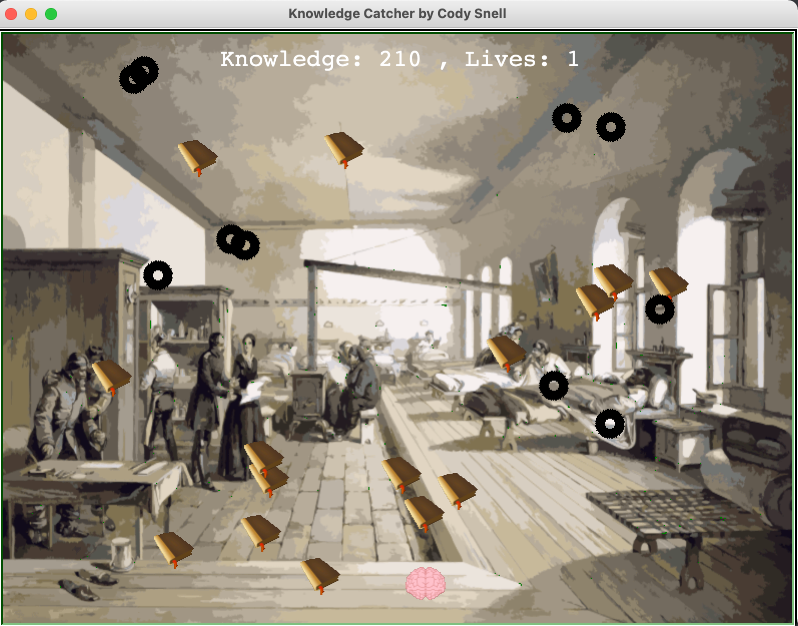

# Knowledge Catcher

This repository contains python based interactive Knowledge Catcher game.

## Running Knowledge Catcher:

```
git clone https://github.com/Decibullz/python-knowledge-catcher.git
cd python-knowledge-catcher
python knowledge-catcher.py
```

## Screenshots
<p align="center">


</p>

## Goals
1. Catch books to increase Knowledge
2. Avoid Spike balls

## Controls
1. Game auto starts
2. Left arrow to move brain left
3. Right arrow to move brain Right
4. Up arrow to stop
5. A track of player Knowledge is maintained
6. A track of player lives is maintained
7. Game ends at 0 lives
8. Game Auto restarts after 5 seconds


## Author
Cody Snell